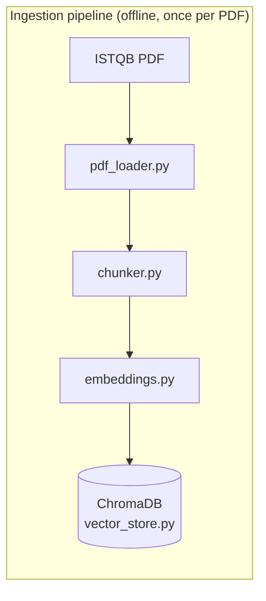
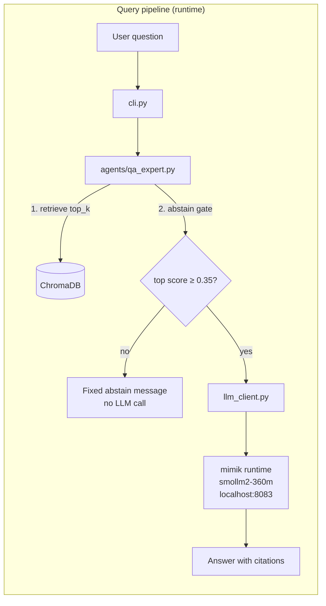
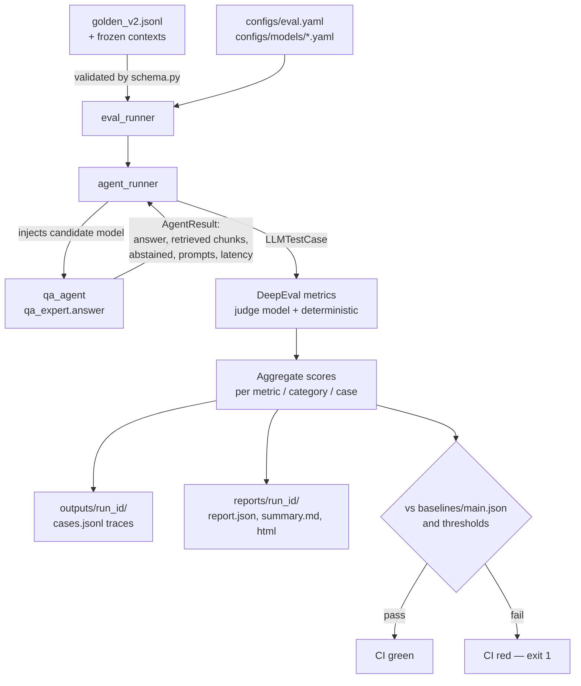

# ARCHITECTURE

How qa-expert-agent works today, and how the DeepEval evaluation framework
will be layered on top of it. Read this before reading code. Living document —
updated at the end of every phase; components not yet built are marked
**(planned — Phase N)**.

Companions: [ROADMAP.md](ROADMAP.md) · [DECISIONS.md](DECISIONS.md) ·
[LEARNING_GUIDE.md](LEARNING_GUIDE.md)

---

# Part 1 — Current Repository

## 1.1 System overview

The repo contains a **single-shot RAG (Retrieval-Augmented Generation)
system**: a question goes in, relevant ISTQB documentation chunks are
retrieved from a vector database, and a local LLM writes a grounded answer.
There is deliberately **no** tool-calling, planning loop, memory, or
multi-turn conversation — those are documented non-goals in CLAUDE.md.

Two pipelines, kept separate in code:





## 1.2 Current request flow (ask command)

1. `qa-agent ask "What is metamorphic testing?"` hits `cli.py:main()`
   (argparse) → `_cmd_ask()`.
2. `_cmd_ask` delegates to `qa_expert.answer(question)` — the agent.
3. The agent embeds the question and queries ChromaDB for the `top_k=2` most
   similar chunks (`vector_store.query()`), each carrying provenance metadata
   (`source_doc`, `page`, `chunk_index`, `chunk_id`) and a cosine-similarity
   score.
4. **Abstain gate:** if retrieval is empty or the best score is below
   `abstain_threshold` (0.35), the agent returns a fixed "I don't have enough
   information…" message *without calling the LLM*. This is the system's
   anti-hallucination safety valve.
5. Otherwise the agent assembles the prompt: static system prompt from
   `prompts/qa_expert.txt` + a user message of numbered context blocks
   followed by the question.
6. `llm_client.chat()` sends both to the mimik runtime (OpenAI-compatible
   API) with a 30 s timeout and one retry.
7. The answer string flows back up and `cli.py` prints it. As of eval
   Phase 1, `answer()` returns an `AgentResult` carrying the full trace
   (see §2.2); the CLI prints `result.answer`.

## 1.3 Components (current)

### `cli.py` — entry point
- **What:** argparse CLI with `ping`, `ingest`, `ask` subcommands; the only
  module allowed to `print()`.
- **Why:** single user-facing seam; keeps I/O out of business logic.
- **Inputs:** argv. **Outputs:** stdout/stderr, exit codes.
- **Talks to:** `qa_expert` (ask), `pdf_loader`/`chunker`/`vector_store`
  (ingest), `llm_client` (ping).

### `config.py` — configuration
- **What:** pydantic-settings class loading `.env`; single source of truth
  for endpoints, model name, retrieval parameters, thresholds, and (Phase 1)
  generation controls.
- **Why:** no constants scattered in code; every tuning knob is visible and
  overridable per environment.
- **Inputs:** `.env` + process env. **Outputs:** a `settings` singleton.

### `agents/qa_expert.py` — the agent (orchestration + "reasoning")
- **What:** the only agent. Orchestrates retrieve → gate → prompt-build →
  LLM call. All decision-making ("should I even answer?") lives here.
- **Why:** CLAUDE.md's layer rule — *agents decide, tools transform*.
- **Inputs:** question string. **Outputs:** `AgentResult` (Phase 1; formerly
  a bare string).
- **Talks to:** `vector_store` (retrieval), `llm_client` (generation),
  `prompts/qa_expert.txt` (persona + format contract).

### `prompts/qa_expert.txt` — the behavior contract
- **What:** versioned system prompt: Senior-QA persona, "answer only from
  context blocks", five-part answer structure, `[page N]` citation rules,
  abstain instruction.
- **Why:** behavior as reviewable text, not buried string literals. Most of
  the future G-Eval metrics are this file, measured.

### `llm_client.py` — sole LLM gateway
- **What:** the only module that talks to an LLM. OpenAI SDK pointed at
  mimik's OpenAI-compatible endpoint; owns timeout/retry policy. Phase 1
  adds: optional injected client + model, and `temperature`/`seed`/
  `max_tokens` pass-through (omitted from the request when unset, preserving
  historical behavior).
- **Why:** one choke point for every LLM call → one place to add injection,
  determinism, and (later) usage/cost capture.
- **Inputs:** system prompt, user message, optional overrides.
  **Outputs:** answer string (raises `MimikUnavailableError` on failure).

### `vector_store.py` — retrieval
- **What:** ChromaDB wrapper (persistent, cosine space). `add_chunks()` for
  ingestion, `query()` returning hits with `score = 1 − cosine distance`
  plus provenance metadata.
- **Why:** retrieval quality is the first lever of RAG quality; isolating it
  lets it be scored independently of the generator.

### `pdf_loader.py`, `chunker.py`, `embeddings.py` — ingestion tools
- **What:** pure transforms. PDF → per-page text; pages → overlapping
  ~500-word chunks with provenance; chunks → MiniLM-L6-v2 vectors (batched).
- **Why:** stateless, individually testable pipeline stages.

### Tests (current)
- `tests/unit/` — 50 tests, LLM mocked, per-module.
- `tests/integration/` — 2 tests, real ChromaDB + real embeddings.
- `tests/golden/` — v1 evaluation harness: 10 Q&A pairs scored by keyword
  matching (`scoring.py`); baseline 3/10 published in RESULTS.md. This is
  the harness DeepEval will supersede (the v1 files stay runnable so the
  baseline remains reproducible).

## 1.4 Current model flow

Exactly one model in the serving path (`smollm2-360m` via mimik, named in
`.env`) plus one embedding model (`all-MiniLM-L6-v2`, in-process via
sentence-transformers). The runtime endpoint is OpenAI-compatible — which is
the seam the whole future adapter layer exploits.

---

# Part 2 — Future Architecture (approved audit design)

Everything below lives in a new top-level `evaluation/` package, **fully
separate from `qa_agent/`** (the system under test). The only SUT changes
were the Phase 1 seams: `AgentResult` and LLM-client injection.

## 2.1 Target folder structure

```
evaluation/                      (planned — Phase 2 scaffold)
├── datasets/    golden_v2.jsonl, frozen contexts/, schema.py   (Phase 3)
├── models/      base.py, adapters, factory.py                  (Phases 2, 6)
├── runners/     agent_runner, eval_runner, benchmark_runner    (Phases 2, 6)
├── metrics/     registry, deterministic + GEval metrics        (Phase 4)
├── configs/     eval.yaml, models/*.yaml                       (Phases 2–6)
├── baselines/   main.json (committed accepted scores)          (Phase 4)
├── outputs/     raw per-run traces (gitignored)                (Phase 2)
└── reports/     html/json/md reports, leaderboards (artifacts) (Phases 4–6)
```

## 2.2 Evaluation data flow



## 2.3 Components (planned)

### `AgentResult` (implemented — Phase 1, lives in `qa_agent/agents/qa_expert.py`)
- **What:** frozen dataclass returned by `answer()`: `answer`, `retrieved`
  (hits with scores + provenance), `abstained`, `system_prompt`,
  `user_message`, `model_name`, `latency_s`.
- **Why:** DeepEval test cases need `input`, `actual_output`, and
  `retrieval_context`; before Phase 1 everything except the answer string was
  logged and discarded. This is the trace-capture seam.
- **Inputs/outputs:** produced by the agent, consumed by CLI (`.answer`) and
  by the future `agent_runner` (everything).

### Golden Dataset v2 (planned — Phase 3)
- **What:** JSONL file, one case per line: `id`, `category`, `difficulty`,
  `tags`, `question`, `expected_answer`, `ground_truth_facts`,
  `expected_retrieval` (source doc + pages), `frozen_context` pointer,
  `expected_behavior` (`answer` | `abstain`), legacy v1 keyword fields, and
  audit metadata. Validated by a pydantic schema at load time.
- **Why:** the versioned, reviewed definition of "good". JSONL diffs line by
  line in PRs; reference answers replace substring matching; `expected_
  retrieval` lets the retriever be scored separately from the generator
  (CLAUDE.md's own tuning rule demands that split).
- **Talks to:** `eval_runner` (load), `agent_runner` (frozen-context
  injection), metrics (references/ground truth).
- **Note:** no `expected_tools` / `expected_plan` fields — the agent has no
  tools or planner. The schema reserves them as optional for future agents.

### Frozen contexts (planned — Phase 3)
- **What:** per-case snapshots of the retrieved chunks, captured once
  locally and committed as small excerpts.
- **Why:** the ISTQB corpus is copyrighted and gitignored, so CI cannot
  rebuild ChromaDB. Frozen contexts let CI evaluate *generation* quality by
  replay; *retrieval* quality is evaluated locally/nightly where the corpus
  exists. Two runner modes: `frozen-context` (CI) vs `live-retrieval`
  (local).

### Model adapter layer (planned — Phases 2 & 6)
- **What:** `ChatModel` protocol — `generate(system, user, GenConfig) →
  ModelResponse (text, latency, tokens, cost)` — with adapters:
  `OpenAICompatibleAdapter` (OpenAI, Ollama, vLLM, mimik, LM Studio — one
  class, different `base_url`), `AnthropicAdapter`, `GeminiAdapter`,
  `HFLocalAdapter`. A factory builds adapters from per-model YAML configs;
  secrets come from env vars *named* in the YAML (`api_key_env`), never
  stored in files.
- **Why:** "evaluation must not depend on one provider" enforced
  structurally: nothing outside `evaluation/models/` knows which SDK is in
  play. Adding a provider = one class + one registry entry.
- **Talks to:** factory ← YAML configs; runners call `generate()`; the
  candidate model is injected into the SUT through the Phase 1
  `llm_client.chat(client=…, model=…)` seam.

### `agent_runner` (planned — Phase 2)
- **What:** the only evaluation module that imports `qa_agent`. Takes a
  dataset case + a built model, executes the agent (live or frozen-context
  mode), maps the `AgentResult` to a DeepEval `LLMTestCase`.
- **Why:** one narrow bridge between eval world and SUT world.

### `eval_runner` (planned — Phase 2)
- **What:** orchestrates a single-model run: load + validate dataset, select
  subset (smoke/full, by tags), run every case through `agent_runner`, run
  the metric registry, aggregate, emit artifacts, compare against thresholds
  and baseline, set the exit code.
- **Why:** the one command CI calls; exit code *is* the quality gate.
- **Outputs:** `outputs/<run_id>/` (raw traces, replayable),
  `reports/<run_id>/` (human-readable), exit code.

### DeepEval + metric registry (planned — Phase 4)
- **What:** DeepEval supplies judge-based metrics (Answer Relevancy ≥ 0.80,
  Faithfulness ≥ 0.90, Hallucination ≤ 0.10, Contextual Precision/Recall)
  and G-Eval custom criteria (ISTQB terminology, five-part format). Two
  deterministic custom metrics need no judge: Abstain Correctness (= 1.0,
  hard gate) and Citation Validity (`[page N]` markers must match retrieved
  pages). Thresholds live in `configs/eval.yaml`.
- **Why:** measures the prompt's actual contracts. Deterministic metrics are
  free and non-flaky; judge metrics catch what string matching cannot. The
  judge model is itself configurable through the adapter layer.
- **Deferred honestly:** Tool Correctness, Task Completion, Plan metrics,
  Conversation Completeness — the agent has no tools, plans, or multi-turn
  memory to measure.

### Reports & baselines (planned — Phase 4)
- **What:** per-run `report.json` (machine), `summary.md` (PR comment),
  `report.html`; `baselines/main.json` holds accepted per-metric scores of
  `main`; history appends to `outputs/history.jsonl`.
- **Why:** absolute thresholds catch bad quality; baseline comparison
  catches *regressions* even while still above threshold; history feeds the
  Phase 7 dashboard.

### CI pipeline (planned — Phase 5)
- **What:** `.github/workflows/eval.yml` — PR: lint/unit → smoke eval
  (frozen-context, ~10–15 cases, cents per run) with sticky PR comment +
  artifacts; nightly/dispatch: full dataset + benchmark matrix. Poetry + HF
  + judge-response caching; API keys as Actions secrets; fork PRs without
  secrets skip judge metrics but keep deterministic gates.
- **Why:** "every commit measured" only exists if a red X enforces it.

### `benchmark_runner` + leaderboard (planned — Phase 6)
- **What:** loops `eval_runner` over N model YAMLs under fairness
  invariants (same dataset version, same pinned judge, temperature 0, frozen
  contexts) and joins per-case scores into `leaderboard.md`/JSON: composite,
  per-metric scores, p50 latency, cost per run. `smollm2-360m` is always the
  anchor row, connecting every leaderboard to the published 3/10 baseline.
- **Why:** turns "which model should we use?" into a table.

### Dashboard (planned — Phase 7)
- **What:** static HTML generated from `history.jsonl`: metric trends per
  commit, leaderboard snapshots, per-category heatmaps.
- **Why:** trends reveal slow drift that single runs hide. Static page —
  never a service.

## 2.4 Why this architecture

- **Additive, not invasive:** the SUT changed in exactly two places
  (AgentResult, injection seam); everything else is a new package. The
  learning-project codebase stays legible.
- **Provider-agnostic by construction:** the adapter/factory boundary means
  eval logic cannot accidentally couple to a vendor SDK.
- **CI-realistic:** frozen contexts solve the copyrighted-corpus problem
  instead of pretending it away; smoke-on-PR / full-nightly keeps judge
  costs at cents.
- **Deterministic where possible:** temperature 0 + seeds + deterministic
  metrics first; judge metrics (inherently variable) are pinned, cached, and
  thresholded on averages.
- **Continuous with history:** the v1 keyword harness and its 3/10 baseline
  stay runnable, so every future number traces back to the first honest
  measurement.
